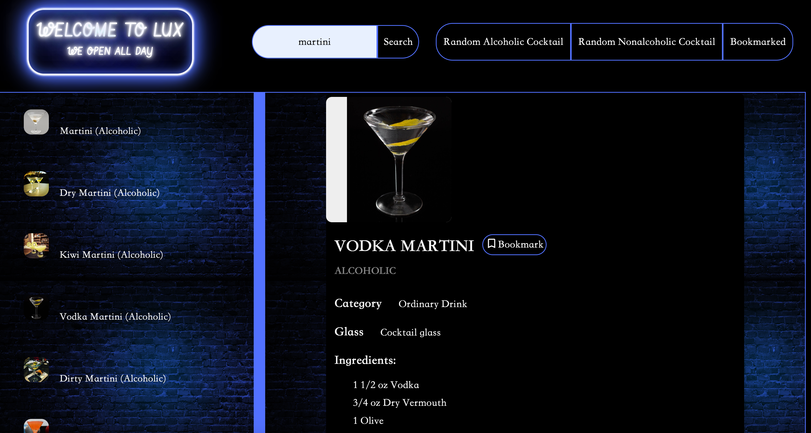
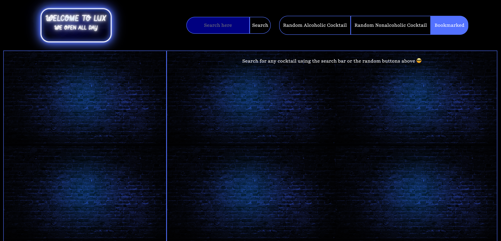

# Lux 調酒酒譜網站

- [Lux 調酒酒譜網站](#lux-調酒酒譜網站)
  - [Website](#website)
    - [所使用的技術](#所使用的技術)
    - [Project 介紹](#project-介紹)
    - [Project 重點](#project-重點)
      - [未來的改善](#未來的改善)

## Website

<https://lux-bar.netlify.app/>

### 所使用的技術

    1. HTML
    2. CSS
    3. JavaScript
    4. localStorage API
    5. TheCocktailDB's API

### Project 介紹

這是一個由 HTML, CSS 以及 JavaScript 所寫成的調酒酒譜網站，利用 JavaScript 與 TheCocktailDB 的資料互動，進而讓使用者得到隨機的無酒精或含酒精的調酒酒譜，也可以藉由調酒的名字查詢酒譜，另外使用者也可以點選 bookmark 按鈕將所選的酒譜儲存，之後便可從"bookmarked"中查看

### Project 重點

⭐️ 請點選圖片至 Youtube 看示範影片 ⭐️

1. 利用 Search bar 查詢酒譜

   

2. 點選"Random Alcoholic Cocktail"或是"Random Nonalcoholic Cocktail"隨機地得到酒譜

   

3. 利用 bookmark 按鈕將酒譜儲存於 localStorage 以便未來能再度查看

   

4. 點選右上角的"Bookmarked"即可看到已儲存的調酒，點選"bookmarked"按鈕即可將酒譜從書籤中刪除

   

5. Responsive Design，經過設計讓使用者不管在桌機、筆電或是平板電腦上都可以順利地瀏覽網站:

   

   

#### 未來的改善

1. 讓使用者可以在手機上查看網站
2. 解決 bookmark 後的酒譜在 page reload 之後即沒有顯示"bookmarked"的問題
